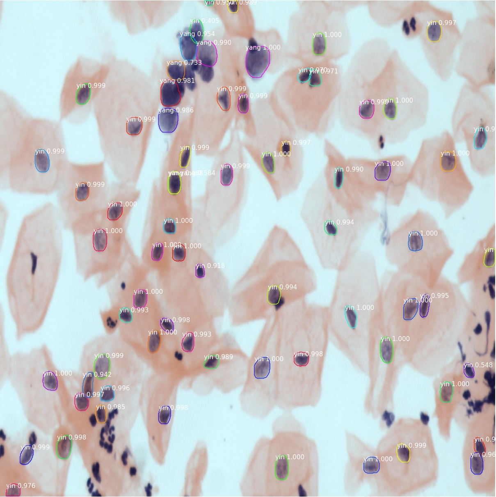

# AI model for cervical cancer screening and diagnosis 


Cervical cancer (CC) is the fourth most common malignant tumor among women worldwide. Here, we proposed a robust deep convolutional neural cervical models for cervical cancer screening.
## 1. Evironment Settings
* Install Labelme  (https://github.com/wkentaro/labelme)
* Configure tensorflow 1.14,  [tf_config.ipynb](code/tf_config.ipynb) shows how to setup tensorflow_gpu-1.14 on a PC machine.
* Clone this github repository to local machine.
* The configuration was tested at PC (Windows 10) and Ubuntu (10.10) workstations, 
CPU: i7-960@3.20GHz quad-core. Memory: 16GB. Graphics card: GeForce GTX 1080 Ti 11GB and GTX 2080 Ti 11GB

## 2. Training Data
* 500 TCT manually labelled images (200X magnification) which contains at least one cancer cell 
[500_tct_labeled_images (827M)](https://drive.google.com/file/d/1f-9OFKZjKRsQNmOB1nLykmdV6jCZ5-uK/view?usp=sharing) 
* 400 TCT whole slide images (WSI) (~800000 images) are avaliable from the corresponding authors on reasonable request
* [yang-211-model-1.tsv](data/patent_predict/yang-211-model-T1.tsv) The cell type prediction results of T1 model for 211 cancer patients
* [yin-189-model-T1.tsv](data/patent_predict/yin-189-model-T1.tsv) The cell type prediction results of T1 model for 189 normal patients
* [yang-211-model-A3.tsv](data/patent_predict/yang-211-model-A3.tsv) The cell type prediction results of A3 model for 211 cancer patients
* [yin-189-model-A3.tsv](data/patent_predict/yin-189-model-A3.tsv) The cell type prediction results of A3 model for 189 normal patients

## 3. MaskRCNN Models
* [coco model (245M)](https://drive.google.com/file/d/1fALkMQN5jK_48-mYIEUhRAhoyUf2Am-Y/view?usp=sharing) coco Model which can be used as the initial model
* [T1_Model (171M)](https://drive.google.com/file/d/1fBKnuIBSGDrvH5gNBiWdfaHnlfnEsy_0/view?usp=sharing) from convertional training method (450/50)
* [A1_Model (171M)](https://drive.google.com/file/d/1fBnTu--B7tLlJyi-GQ8PURwJa6it4xse/view?usp=sharing) from the first iteration of active learning 
* [A2_Model (171M)](https://drive.google.com/file/d/1fEPdwd4B0R1ZuzesB_sj3a5GKwEQb-Ov/view?usp=sharing) from the second iteration of active learning 
* [A3_Model (171M)](https://drive.google.com/file/d/1fEesGkBTMhDQ8jqXx1R3m4Ja_zSep98Y/view?usp=sharing) from the second iteration of  active learning

##  4. Code
### Cell classification
*   [hpv.py](code/cell_classification/hpv.py) Main script to launcth RCNN model training and prediction
*   [PR-Curve.py](code/cell_classification/script/PR-Curve.py) Script to calculate the precision and draw the PR Curves
*   [train.cfg](code/cell_classification/config/train.py) Config file for training model
*   [predict.cfg](code/cell_classification/config/predict.py) Config file for predicting
### patient classfication
*   [patient_classifier.ipynb](code/patient_classification/patient_classifier.ipynb) Python notebook to make ML models (Random forest, Logistic regression, SVM)
*   [xgbools.ipynb](code/cell_classification/script/xgbools.ipynb) Python notebook to make XGBoost model.

## 5. Running
* Download  [500_tct_labeled_images](https://drive.google.com/file/d/1f-9OFKZjKRsQNmOB1nLykmdV6jCZ5-uK/view?usp=sharing) to a dictory (e.g. ./cc_tct_labeled_500_v1)
* Modify configure files [train.cfg](code/cell_classification/config/train.py) or [predict.cfg](code/cell_classification/config/predict.py) as needed
### 5.1 Training Model
```
python hpv.py train --config ./config/train.cfg
```
### 5.2 Predict
```
python hpv.py detect --config ./config/predict.cfg
```
### 5.3 Activate Learning Method
* Splict the training dataset into serveral (e.g. 3) directories 
* Make train.cfg and predict.cfg for each interation
```
# Using initial model (e.g. coco model) to do the first training step
python hpv.py train --config ./config/train_1.cfg
# using the last model for first training procedure to do predict
python hpv.py detect --config ./config/predict_1.cfg
# using labelme to adjust the predict results manually
python hpv.py train --config ./config/train_2.cfg
# using the last model for first training procedure to do predict
python hpv.py detect --config ./config/predict_2.cfg
# using labelme to adjust the predict results manually
....

```
* Run [PR-Curve.py](code/cell_classification/script/PR-Curve.py) to calculate the precision of the model using test data

### 5.4 Patient classfication
* Run prediction using TCT whole slide images (WSI) to get cell classification results such as [yang-211-model-1.tsv](data/patent_predict/yang-211-model-T1.tsv)
* Run [patient_classifier.ipynb](code/patient_classification/patient_classifier.ipynb) and [xgbools.ipynb](code/cell_classification/script/xgbools.ipynb) to do patient classification.
## 6. License
Copyright (c) 2020 Quanyuan He Ph.D.

Contact: Dr. [Quanyuan He ](mailto:hqyone@hotmail.com), Dr. [Junhua Zhou](mailto:zhoujunhua@hunnu.edu.cn)

Released under GPLv3. See
[license](LICENSE.txt) for details.

## 7. Disclaimer
This software is supplied 'as is' without any warranty or guarantee of support. The developers are not responsible for its use, misuse, or functionality. In no event shall the authors or copyright holders be liable for any claim, damages, or other liability arising from, out of, or in connection with this software.
